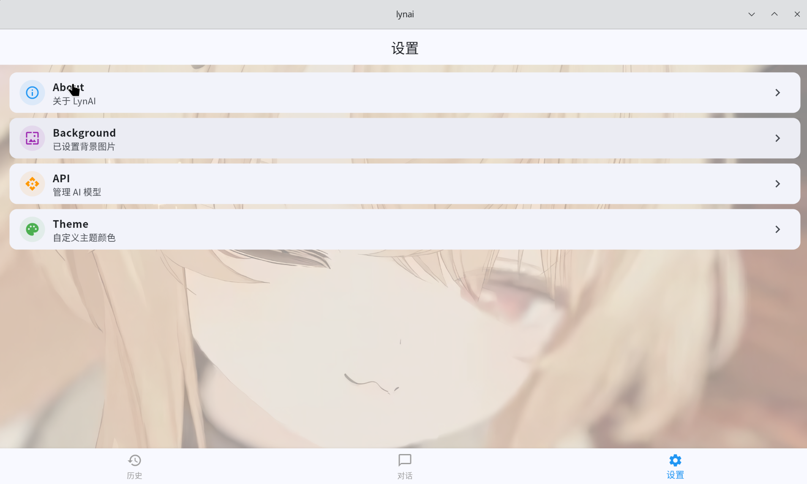

# LynAI

跨平台 AI 对话客户端，基于 Flutter 开发，支持 OpenAI / Ollama / Anthropic 等多种 API，覆盖 Android、iOS、Linux、macOS、Windows 平台。

## 截图

| 设置 | 对话 |
|------|------|
|  |  |

## 功能

- **多模型支持** — OpenAI 兼容接口、Ollama、Anthropic，可自定义 Endpoint
- **多模型管理** — 每提供商下可管理多个子模型，自由切换
- **流式对话** — SSE 实时逐字渲染，聊天体验流畅
- **Markdown + LaTeX** — 支持代码块、公式渲染 (内联 `$...$` / 块级 `$$...$$`)
- **思考过程** — 支持 DeepSeek 等推理模型的思考链展示
- **语音输入** — 语音→转写模型→当前模型回复，全链路自动化
- **图片分享** — 截图对话内容，一键分享
- **历史搜索** — 按标题 / 内容搜索历史对话，关键词高亮
- **主题定制** — 36 种预设色 + HSV 调色板自由组合
- **背景自定义** — 支持图片背景 + 毛玻璃效果

## 支持平台

| 平台 | 状态 |
|------|------|
| Android | ✅ |
| iOS | ✅ |
| Linux | ✅ |
| macOS | ✅ |
| Windows | ✅ |

## 键盘快捷键 (桌面端)

| 操作 | 快捷键 |
|------|--------|
| 发送消息 | `Enter` |
| 换行 | `Shift + Enter` |

> 移动端回车键默认换行。

## 构建

```bash
git clone https://github.com/lynyugiri/lynai.git
cd lynai
flutter pub get
flutter run
```

平台构建:

```bash
flutter build apk --split-per-abi    # Android
flutter build linux                  # Linux
flutter build windows                # Windows
flutter build macos                  # macOS
flutter build ios                    # iOS (需 macOS)
```

需要 Flutter SDK ^3.11.5。

## 技术栈

| 类别 | 技术 |
|------|------|
| 框架 | Flutter SDK ^3.11.5 |
| 状态管理 | Provider + ChangeNotifier |
| HTTP | http |
| 持久化 | SharedPreferences (JSON) |
| Markdown | flutter_markdown |
| 语音识别 | speech_to_text |
| 图片选择 | image_picker |
| 分享 | share_plus |
| 截图 | screenshot |
| UI | Material 3, ColorScheme.fromSeed |

## CI/CD

GitHub Actions 自动构建 (`.github/workflows/build.yml`):

| 平台 | 架构 | Runner |
|------|------|--------|
| Android APK | arm64-v8a, armeabi-v7a, x86_64 | ubuntu-latest |
| Linux | x86_64 | ubuntu-latest |
| Windows | x86_64 | windows-latest |

## 项目文档

- [页面与路由](doc/pages.md)
- [架构概览](doc/architecture.md)
- [数据模型](doc/models.md)
- [状态管理](doc/providers.md)
- [API 服务](doc/services.md)

## 许可证

[GNU General Public License v3.0](LICENSE)
